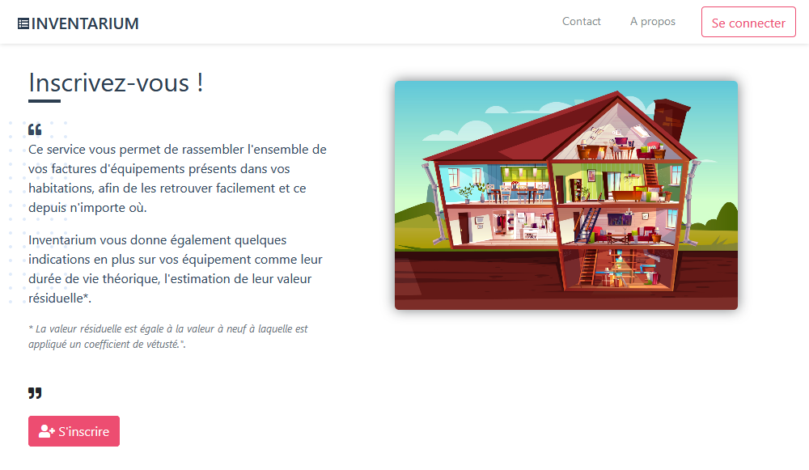

# Project 13 - Inventarium

    
    
    
    
    

**Final project: ready for the fireworks?**

Inventarium is the final project of a training from the pacifix application developer - Python offered by [OpenClassrooms](https://openclassrooms.com). It's about developing a free project with social significance.

# INVENTARIUM

This service allows you to collect all of your equipment bills in your homes, to find them easily and from anywhere.
Inventarium also gives you some more indications about your equipment as their theoretical life, the estimate of their residual value*.

*The residual value is equal to the new value to which a coefficient of obsolescence is applied.*

***

## Deployement

> Website: [www.inventarium.me](https://www.inventarium.me)

## Built With

* [Python 3.7](https://www.python.org/) - Python is a programming language that lets you work quickly and integrate systems more effectively.
* [Django](https://www.djangoproject.com/) - Django is a high-level Python Web framework that encourages rapid development and clean, pragmatic design. Built by experienced developers, it takes care of much of the hassle of Web development, so you can focus on writing your app without needing to reinvent the wheel. It’s free and open source.
* [Gunicorn](https://gunicorn.org/) - Gunicorn 'Green Unicorn' is a Python WSGI HTTP Server for UNIX. It's a pre-fork worker model. The Gunicorn server is broadly compatible with various web frameworks, simply implemented, light on server resources, and fairly speedy.
* [Nginx](https://www.nginx.org/) - nginx [engine x] is an HTTP and reverse proxy server, a mail proxy server, and a generic TCP/UDP proxy server, originally written by Igor Sysoev.
* [Supervisor](http://supervisord.org/) - Supervisor is a client/server system that allows its users to monitor and control a number of processes on UNIX-like operating systems.

## Continuous integration
* [Travis CI](https://travis-ci.com/) - Easily sync your GitHub projects with Travis CI and you’ll be testing your code in minutes!

## Monitoring
* [Sentry](https://sentry.io/welcome/) - Open-source error tracking that helps developers monitor and fix crashes in real time. Iterate continuously. Boost efficiency. Improve user experience.

## Authors

* **Vincent Houillon** - *Initial work* - [vincenthouillon](https://github.com/vincenthouillon)

## Acknowledgments

* [OpenClassrooms](https://openclassrooms.com)
